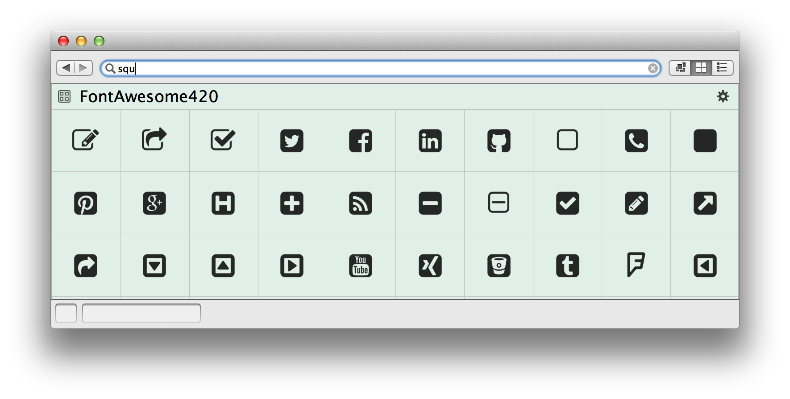

#GraffleExt

> 这里是我个人制作的 [OminiGraffle](https://www.omnigroup.com/omnigraffle) 扩展包括 Stencil 和 Template 模板等内容。所有的图标 Stencil 都支持关键字搜索如下图。
> Searchable Support !!
>
> + 2015.05.26 增加 Bluemap Template 0526
> + 2014.09.24 更新 Font Awesome 4.2.0
> + 2014.09.29 更新 GlyhIcons 1.8.1
> + 2015.02.04 更新 Font Awesome 4.3.0

##Font Awesome 4.3.0 Stencil （519 Icons）
> [Font Awesome](http://fortawesome.github.io/Font-Awesome/) gives you scalable vector icons that can instantly be customized — size, color, drop shadow, and anything that can be done with the power of CSS.

使用方法：安装 [Font Awesome](https://github.com/FortAwesome/Font-Awesome/raw/master/fonts/FontAwesome.otf) 字体；下载 [Font Awesome Stencil](FontAwesome430.gStencil?raw=true) 模板。

##GlyhIcons 1.8.1 Stencil （850 Icons）
> [GlyhIcons](http://glyphicons.com/) is a library of precisely prepared monochromatic icons and symbols. Icons are designed primarily for toolbars and navigation bars in OS X, the applications for iPhone, iPad and other Apple devices.

使用方法：安装 [GlyphIcons](http://glyphicons.com/wp-content/themes/glyphicons/sk/public/fonts/glyphicons-regular.ttf) 字体；安装 [GlyphIcons Halflings](http://glyphicons.com/wp-content/themes/glyphicons/sk/public/fonts/glyphicons-halflings-regular.ttf) 字体；安装 [GlyphIcons Social](http://glyphicons.com/wp-content/themes/glyphicons/sk/public/fonts/glyphicons-social-regular.ttf) 字体；安装 [GlyphIcons Filetypes](http://glyphicons.com/wp-content/themes/glyphicons/sk/public/fonts/glyphicons-filetypes-regular.ttf) 字体；下载 [GlyphIcons Stencil](GlyphIcons181.gStencil?raw=true) 模板。
