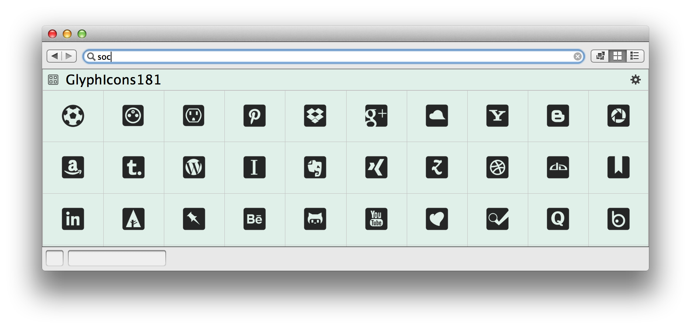
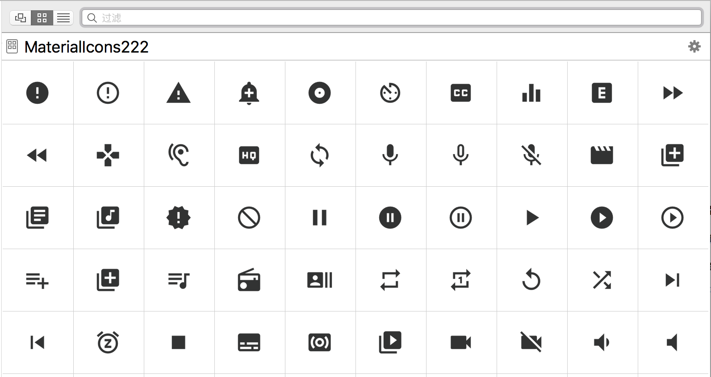
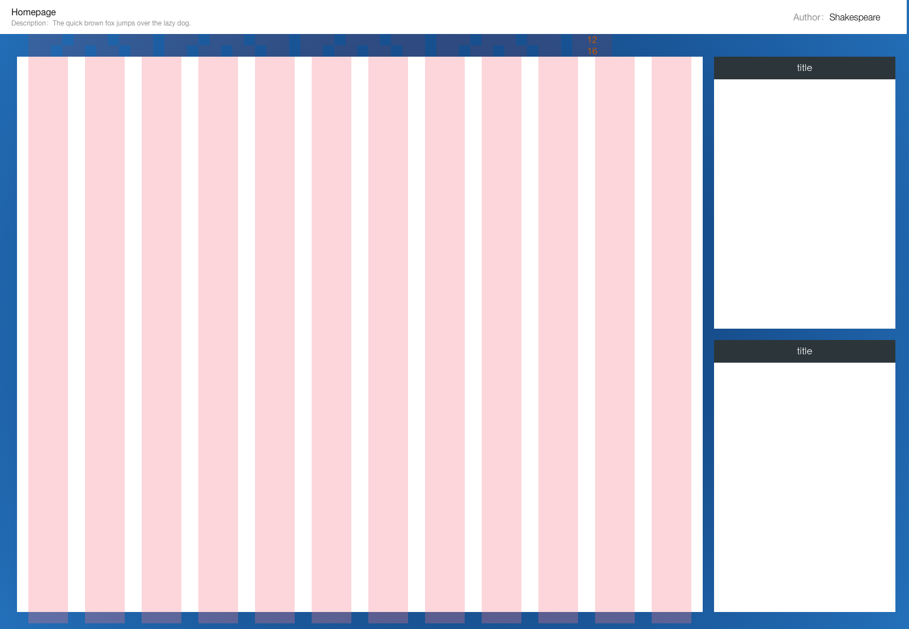

#GraffleExt

> 我制作的 [OminiGraffle](https://www.omnigroup.com/omnigraffle) 扩展包括 Stencil 和 Template 所有图标都支持关键字检索。
> Searchable Support !!
> 
> Updates:
> + 2016.10.29 更新 Font Awesome 4.7.0
> + 2016.05.18 更新 Font Awesome 4.6.3
> + 2016.05.06 更新 Font Awesome 4.6.2
> + 2016.02.28 新增 Google Material Icons 2.2.2
> + 2016.01.24 更新 GlyhIcons 1.9.2
> + 2015.11.29 更新 Font Awesome 4.5.0
> + 2015.07.29 更新 GlyhIcons 1.9
> + 2015.07.29 更新 Font Awesome 4.4.0
> + 2015.05.26 增加 Bluemap Template 0526
> + 2015.02.04 更新 Font Awesome 4.3.0
> + 2014.09.29 新增 GlyhIcons 1.8.1
> + 2014.09.24 新增 Font Awesome 4.2.0

## gStencil：Font Awesome 4.7.0 Stencil （675 Icons）
> [Font Awesome](http://fortawesome.github.io/Font-Awesome/) gives you scalable vector icons that can instantly be customized — size, color, drop shadow, and anything that can be done with the power of CSS.

使用方法：安装 [Font Awesome](https://github.com/FortAwesome/Font-Awesome/raw/master/fonts/FontAwesome.otf) 字体；下载 [Font Awesome Stencil](Stencils/FontAwesome470.gStencil?raw=true) 模板。

## gStencil：GlyhIcons 1.9.2 Stencil （1310 Icons）
> [GlyhIcons](http://glyphicons.com/) is a library of precisely prepared monochromatic icons and symbols. Icons are designed primarily for toolbars and navigation bars in OS X, the applications for iPhone, iPad and other Apple devices.

使用方法：安装 [GlyphIcons](http://glyphicons.com/fonts/glyphicons-regular.ttf) 字体；安装 [GlyphIcons Halflings](http://glyphicons.com/fonts/glyphicons-halflings-regular.ttf) 字体；安装 [GlyphIcons Social](http://glyphicons.com/fonts/glyphicons-social-regular.ttf) 字体；安装 [GlyphIcons Filetypes](http://glyphicons.com/fonts/glyphicons-filetypes-regular.ttf) 字体；下载 [GlyphIcons Stencil](Stencils/GlyphIcons192.gStencil?raw=true) 模板。

## gStencil：Google Material Design Icons 2.2.2 Stencil（932 Icons）

> [Google Material Icons](https://design.google.com/icons/) are beautifully crafted, delightful, and easy to use in your web, Android, and iOS projects.
> Material design icons are the official icon set from Google.

使用方法：安装 [Material Icons](https://raw.githubusercontent.com/google/material-design-icons/master/iconfont/MaterialIcons-Regular.ttf) 字体；下载 [Material Icons Stencil](Stencils/MaterialIcons222.gStencil?raw=true) 模板。

## gTemplate：BlueMap

> 蓝图模板，网页应用及移动应用模板。

